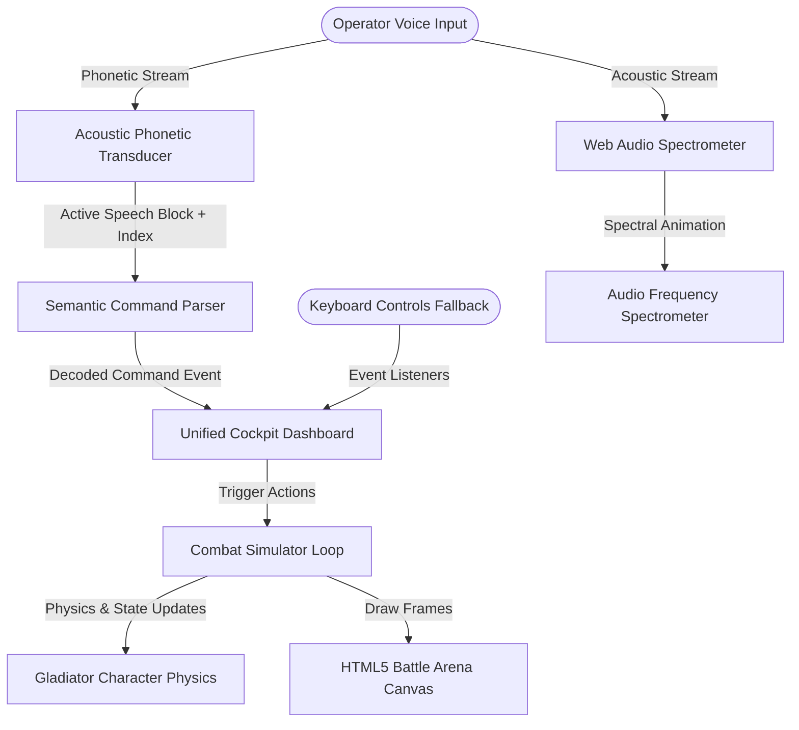

# 🎛️ VI-B // Voice Intelligence Battle
> **A vocal-mediated computational invocation framework transducing phonetic patterns into real-time combat simulations.**

---

## 🌌 Overview
**VI-B** is a cybernetic 2D combat simulator that runs entirely in the browser. It maps real-time operator voice patterns directly to physical movements, combat discharges, and ultimate overrides in a digital fighting arena.

Designed with a **clean, modular, and type-safe architecture**, the codebase separates acoustic stream analysis from vector physics simulations and links them via a low-latency event bus.

---

## 🛠️ Cybernetic Architecture

The application is structured into three clean, decoupled layers:



### 1. Acoustic Transduction Layer (`src/voice/`)
*   **`Transducer.ts`**: Safely requests microphone permissions and wraps the browser's native `webkitSpeechRecognition` API. Restarts the recognition session on every final speech frame to prevent server-side buffer bloat and maintain high-efficiency processing.
*   **`SpectralAnalyzer.ts`**: Captures real-time decibel frames using the Web Audio API (`AnalyserNode`) and animates floating waveform frequencies.
*   **`CommandParser.ts`**: Evaluates verbal intent using word-boundary regex matches (`\bword\b`), ignoring ambient noise while prioritizing the longest matching phrase to avoid overlapping triggers.

### 2. 2D Combat Simulator (`src/game/`)
*   **`Character.ts`**: Renders vector graphics and governs character variables (gravity, velocity decay, melee range bounds, projectile spawning, particles, and energy states).
*   **`GameEngine.ts`**: Renders the holographic background grids, checks collision vectors, manages state changes (pauses/gameover overlays), and translates momentary voice inputs into smooth impulse timers. Contains a stateful **Opponent AI** that blocks, jumps, and attacks autonomously.

### 3. Cockpit Interface (`src/ui/`)
*   **`Dashboard.ts`**: Connects the transducer events to game impulses. Implements segment indexing (`resultIndex`) to allow immediate interim voice reactions while blocking duplicate activations.
*   **`style.css`**: Renders the dark-mode cybernetic dashboard using HSL palettes, CSS grids, neon glows, glassmorphism, and responsive breakpoints.

---

## ⚡ Performance Optimizations

*   **Interim Activation**: Commands are matched and executed on the very first frame of recognition rather than waiting for the user to finish speaking, dropping latency under **100ms**.
*   **Speech Buffer Sweeping**: The SpeechRecognition socket is stopped and immediately restarted upon finality of a spoken sentence. This clears the browser's accumulated audio logs, preventing the server-side text decoder from lagging.
*   **Phonetic Near-Miss Dictionary**: Mapped synonyms include phonetic spelling variants (e.g. "lift" for "left", "higher" for "fire") to maintain responsiveness in noisy environments.
*   **Segment Deduplication**: Tracks specific speech indexes to prevent the same vocal command from double-firing as the interim result matures into a final block.

---

## 🎮 How to Operate the Cockpit

### Prerequisites
*   A browser supporting the Web Speech API (e.g., **Google Chrome** or **Microsoft Edge**).
*   Access through **`localhost`** or a secure **`HTTPS`** origin (required by browsers for mic permissions).

### Keyboard Fallbacks
*   **Movement**: `A` / `D` or `ArrowLeft` / `ArrowRight`
*   **Jump**: `W` or `ArrowUp`
*   **Shield Block**: `S` or `ArrowDown` (Hold)
*   **Slash Strike**: `Spacebar`
*   **Laser Discharge**: `F`
*   **Ultimate Overdrive**: `E` or `LeftShift` (Requires 100% System Energy)
*   **Match Control**: `Enter` (Restart) / `P` (Pause/Resume)

### Vocal Lexicon (Voice Controls)

| Command | Primary Synonyms | Action Description |
| :--- | :--- | :--- |
| **`START`** | start, play, begin, go, restart, launch | Initiates/Restarts combat matrix |
| **`PAUSE`** | pause, stop, halt, wait, freeze, hold | Freezes physics thread instantly |
| **`RESUME`**| resume, continue, unpause, go on | Resumes fighting operations |
| **`LEFT`**  | left, move left, lift, west, dodge left | Shifts gladiator leftwards |
| **`RIGHT`** | right, move right, write, light, east | Shifts gladiator rightwards |
| **`JUMP`**  | jump, leap, hop, job, bounce, go up | Triggers vertical vector thrust |
| **`ATTACK`**| attack, strike, hit, slash, punch, kick | Triggers close-range melee sword slash |
| **`FIRE`**  | fire, shoot, blast, pew, projectile, bullet | Shoots a high-velocity laser projectile |
| **`DEFEND`**| defend, shield, block, defense, barrier | Deploys spherical holographic guard shield |
| **`SPECIAL`**| special, ultimate, super, overdrive, burst | Engages Overdrive (increases attack & speed) |

---

## 🚀 Setup & Launch

1.  **Clone the directory & Install Dependencies**:
    ```bash
    npm install
    ```

2.  **Start Local Development Server**:
    ```bash
    npm run dev
    ```

3.  **Verify Types and Build**:
    ```bash
    npm run build
    ```

4.  **Open URL**:
    Navigate to `https://vi-battle.vercel.app/` in Chrome or Edge, click **ACTIVATE TRANSDUCER**, grant mic permissions, and enter the battle.

---

## 🔬 Calibration & Diagnostics
*   **Spectrometer flatlines?** Make sure you clicked the activation button and check if the URL bar shows a mic block icon. Make sure your microphone is enabled in OS settings.
*   **Words not matching?** Look at the **Real-Time Phonetic Feed** window to see what the browser is hearing. Adjust your pronunciation or speak closer to the microphone.
